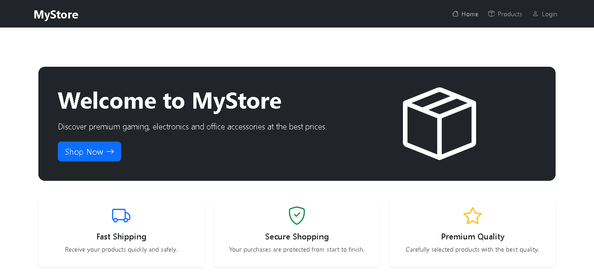
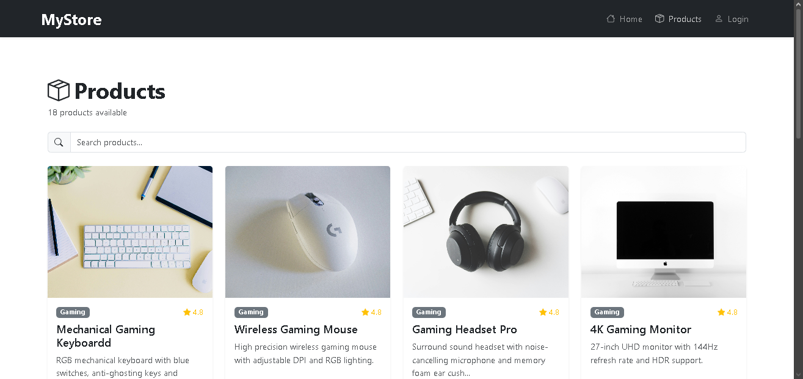
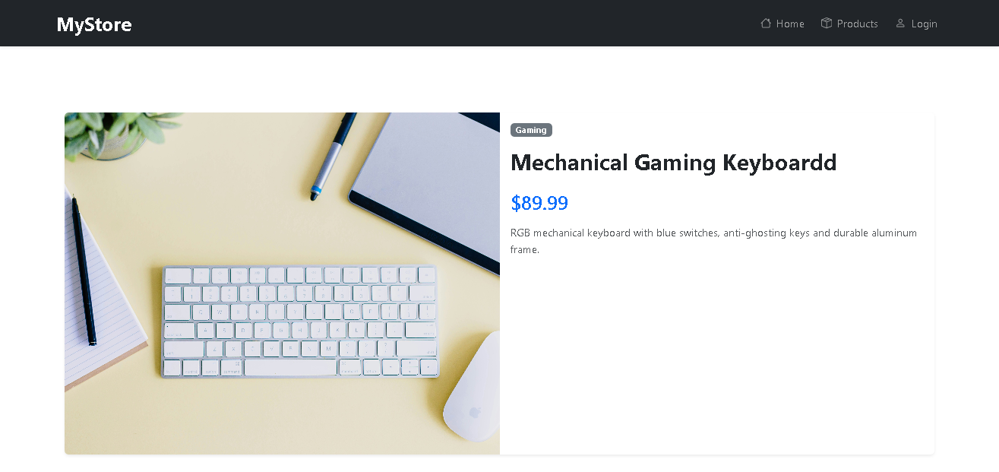
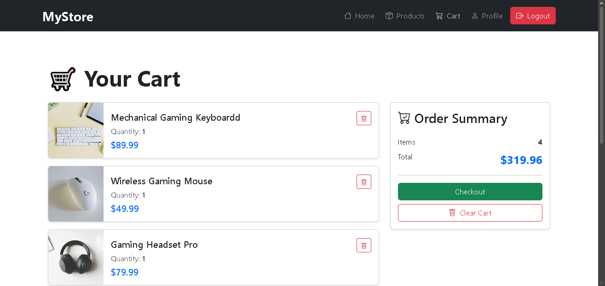
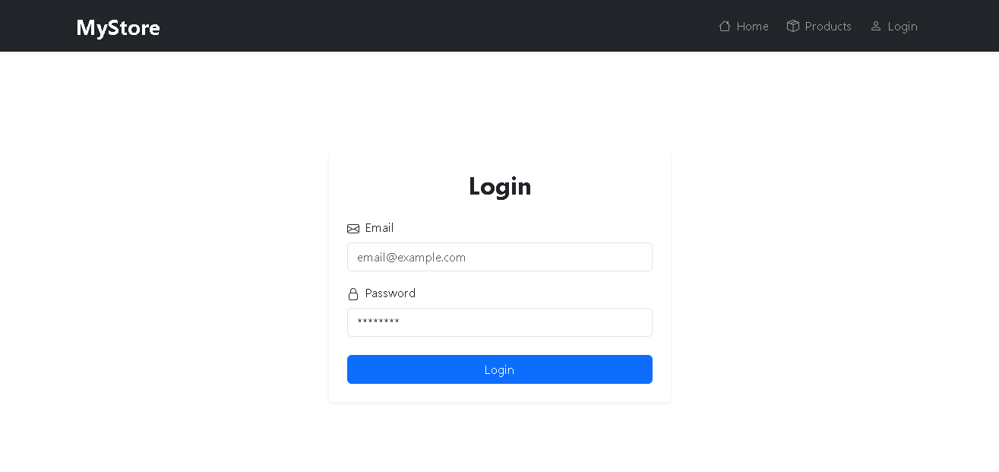
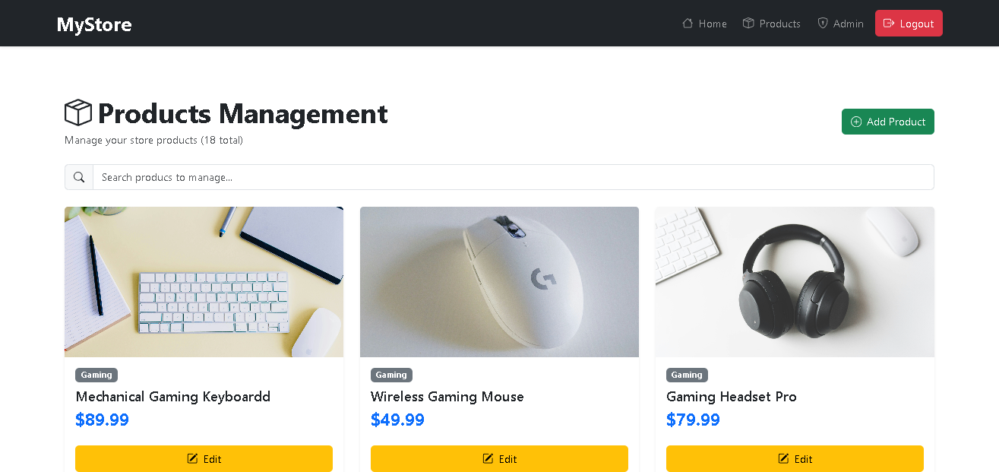
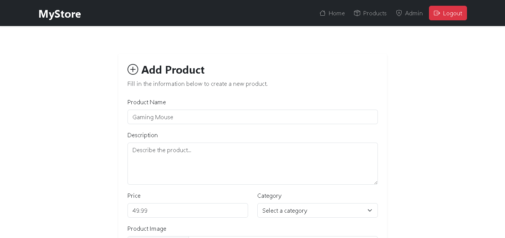
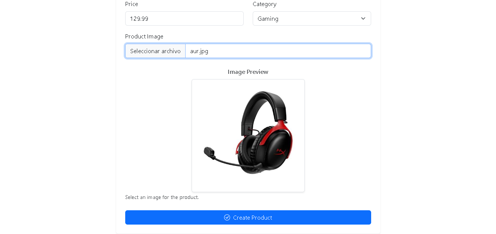

# 🛒 NovaCart

NovaCart es una aplicación web de comercio electrónico desarrollada con React y Vite.

La aplicación permite a los usuarios explorar productos, buscar productos, consultar sus detalles y administrar un carrito de compras. También cuenta con un panel de administración desde el cual se pueden crear, editar y eliminar productos.

Las imágenes de los productos se gestionan mediante Cloudinary, mientras que los datos de la aplicación son gestionados mediante una API.

## 🚀 Demo

🔗 [Ver aplicación](https://nova-cart-theta.vercel.app)

## 📸 Capturas de pantalla

### 🏠 Página de inicio



### 🛍️ Productos



### 🔎 Detalle del producto



### 🛒 Carrito de compras



### 🔐 Inicio de sesión



### ⚙️ Administración de productos



### ➕ Crear producto



### 🖼️ Subida de imágenes



## ✨ Funcionalidades

### 👤 Usuarios

* Registro e inicio de sesión.
* Autenticación basada en roles.
* Navegación por el catálogo de productos.
* Búsqueda de productos.
* Visualización del detalle de cada producto.
* Agregar productos al carrito.
* Aumentar y disminuir cantidades.
* Eliminar productos del carrito.
* Vaciar el carrito.
* Visualización del perfil.

### 👨‍💼 Administradores

* Acceso al panel de administración mediante roles.
* Visualización y gestión del catálogo.
* Creación de productos.
* Edición de productos.
* Eliminación de productos.
* Subida de imágenes.
* Vista previa de imágenes antes de subirlas.
* Gestión de imágenes mediante Cloudinary.

### 🎨 Interfaz y experiencia de usuario

* Diseño responsive.
* Navbar responsive.
* Menú hamburguesa para dispositivos móviles.
* Estados de carga.
* Validación de formularios.
* Notificaciones mediante React Toastify.
* Estados vacíos.
* Grid responsive de productos.
* Cards de productos.
* Interfaz de administración.
* Adaptación para desktop, tablet y mobile.

## 🛠️ Tecnologías utilizadas

### Frontend

* React
* Vite
* React Router DOM
* React Hook Form
* Bootstrap
* React Icons
* React Toastify
* Axios

### Backend

* Node.js
* Express
* MongoDB
* Mongoose
* JWT
* Zod

### Servicios

* Cloudinary
* Vercel

## 📁 Estructura del proyecto

```text
MyStore/
├── public/
├── screenshots/
│   ├── home.png
│   ├── products.png
│   ├── product-details.png
│   ├── cart.png
│   ├── login.png
│   ├── admin-products.png
│   ├── create-product.png
│   └── image-upload.png
│
├── src/
│   ├── components/
│   │   ├── AdminProductCard.jsx
│   │   ├── CartItem.jsx
│   │   ├── Loader.jsx
│   │   ├── Navbar.jsx
│   │   ├── ProductCard.jsx
│   │   ├── ProductForm.jsx
│   │   ├── SearchProduct.jsx
│   │   └── Summary.jsx
│   │
│   ├── context/
│   │   ├── auth/
│   │   ├── cart/
│   │   └── products/
│   │
│   ├── pages/
│   │   ├── HomePage.jsx
│   │   ├── ProductsPage.jsx
│   │   ├── ProductPage.jsx
│   │   ├── CartPage.jsx
│   │   ├── LoginPage.jsx
│   │   ├── ProfilePage.jsx
│   │   ├── AdminProductsPage.jsx
│   │   ├── CreateProductPage.jsx
│   │   └── EditProductPage.jsx
│   │
│   ├── services/
│   │   └── cloudinary.js
│   │
│   └── App.jsx
│
├── .gitignore
├── package.json
├── vercel.json
└── README.md
```

## ⚙️ Instalación

Cloná el repositorio:

```bash
git clone TU_URL_DEL_REPOSITORIO
```

Ingresá a la carpeta del proyecto:

```bash
cd mystore
```

Instalá las dependencias:

```bash
npm install
```

## 🔐 Variables de entorno

Creá un archivo `.env` en la raíz del proyecto:

```env
VITE_CLOUDINARY_CLOUD_NAME=tu_cloud_name
VITE_CLOUDINARY_UPLOAD_PRESET=tu_upload_preset
```

Agregá también las variables de entorno necesarias para la API, autenticación y demás servicios utilizados por el proyecto.

> ⚠️ Nunca subas el archivo `.env` al repositorio ni expongas credenciales privadas.

## ▶️ Ejecutar el proyecto

Para iniciar el servidor de desarrollo:

```bash
npm run dev
```

La aplicación estará disponible normalmente en:

```text
http://localhost:5173
```

## 🏗️ Build de producción

Para generar la versión de producción:

```bash
npm run build
```

Para visualizar la versión de producción localmente:

```bash
npm run preview
```

## 🖼️ Subida de imágenes

Las imágenes de los productos se gestionan mediante Cloudinary.

El proceso funciona de la siguiente manera:

1. El administrador selecciona una imagen.
2. Se muestra una vista previa.
3. La imagen se sube a Cloudinary.
4. Cloudinary devuelve una `secure_url`.
5. La URL de la imagen se guarda junto con la información del producto.

De esta manera, las imágenes no necesitan almacenarse directamente dentro del proyecto.

## 🔑 Roles de usuario

La aplicación cuenta con dos roles principales.

### Usuario

Los usuarios pueden:

* Explorar productos.
* Buscar productos.
* Ver detalles de productos.
* Agregar productos al carrito.
* Modificar cantidades.
* Eliminar productos del carrito.
* Vaciar el carrito.
* Acceder a su perfil.

### Administrador

Los administradores pueden:

* Acceder al panel de administración.
* Crear productos.
* Editar productos.
* Eliminar productos.
* Subir imágenes.
* Actualizar imágenes de productos.
* Administrar el catálogo.

## 🛒 Carrito de compras

El carrito permite a los usuarios:

* Agregar productos.
* Aumentar o disminuir cantidades.
* Eliminar productos individualmente.
* Vaciar el carrito.
* Consultar el precio total.

También se tiene en cuenta el stock disponible al agregar o modificar productos dentro del carrito.

## 🔎 Búsqueda de productos

Los usuarios pueden buscar productos dentro del catálogo mediante el buscador.

La aplicación también maneja los casos en los que una búsqueda no devuelve resultados, mostrando un estado vacío apropiado.

## 📱 Diseño responsive

MyStore está adaptado para diferentes tamaños de pantalla:

* 💻 Desktop
* 📱 Mobile
* 📟 Tablet

Se utilizan las herramientas responsive de Bootstrap para adaptar la interfaz a diferentes dispositivos.

## 🧪 Validación y feedback

Los formularios utilizan React Hook Form para gestionar los datos ingresados y realizar validaciones.

La aplicación también utiliza React Toastify para mostrar notificaciones al usuario después de diferentes acciones, como:

* Inicio de sesión exitoso.
* Agregar productos al carrito.
* Eliminar productos del carrito.
* Vaciar el carrito.
* Crear productos.
* Editar productos.
* Eliminar productos.
* Cerrar sesión.

## 🌐 Deploy

La aplicación está desplegada utilizando Vercel.

Además, se incluye un archivo `vercel.json` para configurar correctamente las rutas de React Router y evitar problemas al actualizar o acceder directamente a una ruta de la aplicación.

## 👨‍💻 Autor

**José Germán**

Desarrollador Full Stack

Este proyecto fue desarrollado como parte de mi portfolio para demostrar conocimientos en desarrollo web moderno, React, APIs REST, autenticación, gestión de roles, desarrollo de aplicaciones de comercio electrónico y diseño responsive.

---

⭐ Si te gustó el proyecto, podés visitar el repositorio y explorar el código fuente.
